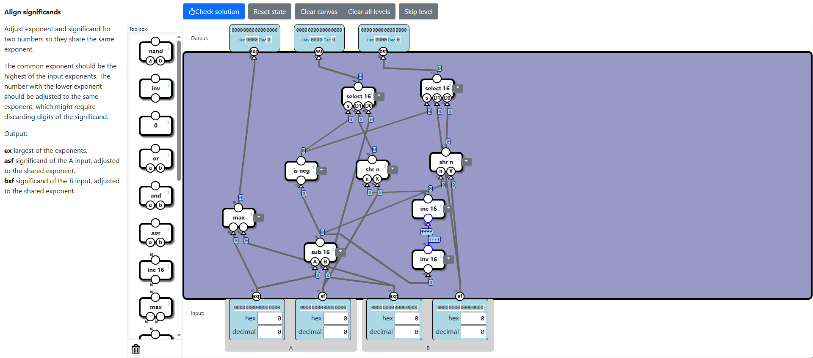

# Floating Point Arithmetics
In this subcategory we get to learn about floating-points, how are they packed/unpacked into/from a 16-bit value, and we also get to implement floating-point operations.

## Unpack floating-point value
In this level we have to unpack a floating-point value from a 16-bit input. The output will be divided into sign, exponent and significand. The sign represents the sign of the number, the exponent represents the power of the base which is then multiplied to the significand in order to get the final floating-point value. Since the significand is normalized, it means that it uses an implicit bit, which is always 1, resulting in a 11 binary digit precision. If the exponent part is 0, we get to represent values below what is representable by the floating-point format, meaning a loss in precision.  

So in order to solve this, we use a **Splitter** to extract each bit and bundle them together for the output. We connect the  bit 15 to the sign output. We bundle the bits 14 to 10 and connect the bundle to the **exp** output. If the bundle is 0, we don't add the implicit bit to the significand, meaning that we are dealing with a loss in precision. We bundle together the rest of the bits in order to get the significand, and connect the result to the **sf** output.

## Floating-point multiplication
In this level we implement floating-point multiplication using the unpacked floating-point values. We will learn why this operations is fast. To multiply the sign bits we us a **Xor** gate, since multiplying + and - we get -. Then we add the exponents together, since this is what happens when we multiply powers with the same base. We of course don't forget to subtract the bias from the exponent which, for a 5-bit exponent is 15. The significands of the two values we simply multiply. After all of this is done we get the final solution.

## Normalize overflow
In this level we learn how to handle overflow, when the significand exceeds the maximum precision allowed by the floating-point format. For a 16 bit floating-point, we only have 11 bits precision, which also include the implicit bit, the most significant digit. What happens when 12th bit is also 1? We have to normalize it, by shifting it to right and incrementing the exponent, which means that we lose precision, but we preserve the approximation. The solution is straight forward.

## Verify exponent
In this level we just set the exponent to 31, since a 5-bit exponent maximum value is 31, whenever it exceeds tha value 30. We check all the bits from the 6th bit up to the most significant that they are 0. If not, we set the exponent to 31. Here is the solution.

## Align significands
In this level we learn to align significands so that they share the same exponent. This is helpful for adding or subtracting floating-points, since this requires for both operands to have the same exponent. The final exponent should be the max of the two. We align the significand based on which has the lower exponent, by shifting to right the same number of times as the difference of the exponents. This will lead to loss of precision. The solution can be implemented as explained.

## Add signed magnitude
This level is a little bit tricky because the output is a sign and an unsigned value. When we add them together we get the final result, a sign and the unsigned result. We have to implement addition and subtraction using this format. We do this, by selecting between the inputs and their negatives based on the sign. We connect the selections to Add and Sub components. After that we select the sign of the results based on the operation selected and we get the absolute of the result for the magnitude output. In the end we get the folowing solution.

## Normalize underflow
In this level we have to deal with values that have less than 11 digits, and normalize them and adjust the exponent. Basically we have to shift the value to the left until we have 11 digits and subtract from the exponent the amount of shifts we did. The solution is not the optimal one and the level does not provide a verification for optimality. It has two major parts, one that shifts to left until the bit 10 is 1, using **Bit** component, and the other, which counts the number of shifts and subtracts them from the exponent. The **Bit** component gets an input, and based on the value set, which in our case is 0xA (10), it outputs the value of the input bit on that position. Every time we shift, we verify next if bit 10 of the shift is still 0. At each select if the bit is 0, it means there is a shift needed. We invert the output of the **Bit** components, add all the 1s to count the number of shifts needed for normalization and subtract the result from the exponent. The solution is the following.

## Pack floating point value
This level is about packing a floating-point value from 3 inputs: sign, exponent and significant. We will use what we built in the previous levels. We check for 12th bit, if it's 1 we normalize the over flow, if its 0 we normalize the underflow which shifts the significant to left until 11th bit is 1. We then verify the exponent if it goes out of range. In the end we connect the bits according to the floating-point format. We get this solution.

## Floating-point multiplication
This level is easy because we have all the components we need, the **Float Unpack** component, **Multiplication** component and **Float Pack** component. The solution is straightforward.

## Floating-point addition
Again, another easy level. When we add two floating-point values we first need to unpack them, then we align them in order to have the same exponent. At the end we add the aligned floating-points and pack the result. We get this solution.

