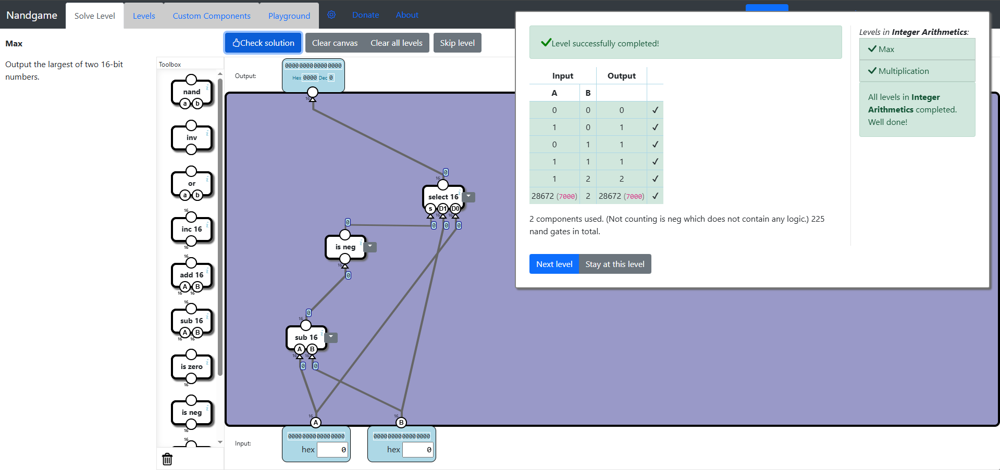
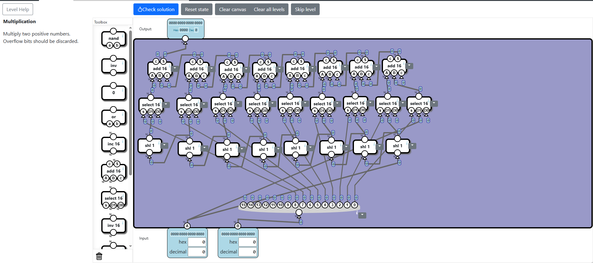

# Integer Arithmetics
In this subcategory, we will implement **Max** and **Multiplication** components for integers at the hardware level.

## Max
In this level, the idea is to subtract the values and, depending on the sign of the result, choose which one is greater. If the first input is greater, then the difference must be positive. Using this concept, we get the final solution.



## Multiplication
The solution for this level is based on the idea of using the bits of one number to left shift the other multiple times and add all these results together. The number of times we shift the second number is based on the positions of the bits that are set to 1 in the first number. Here is an example:
```
4 x 5 = ?

In binary these are:
4 = 100
5 = 101

We shift 4 based on the digit positions of value 5 where the digits are 1. If the first bit is 1, we don't left shift 4 but we add it. The second bit is 0, so we don't shift 4 to the left. The third bit is 1, so we left shift 4 two times and get 10000 = 16. We add these binary numbers and get 10100, which is 20.
```

Using this idea, we manage to implement a final solution:


