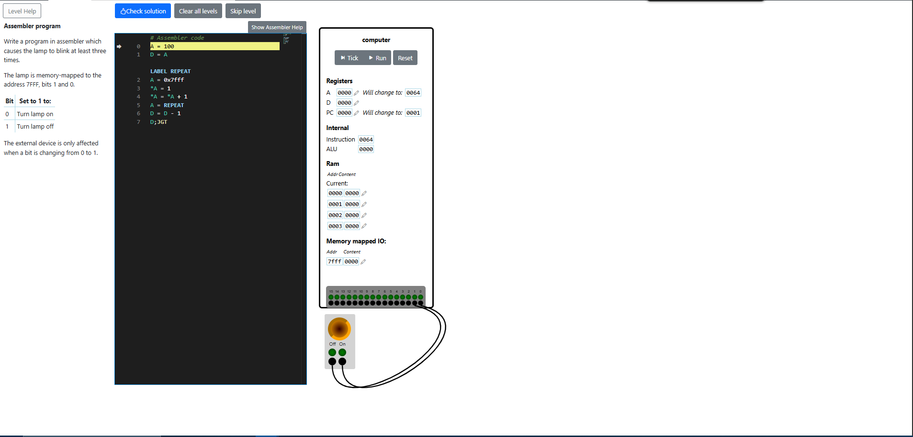

# Assembler Program
In this level, we get to execute instructions from Assembly language. The problem requires us to turn a lamp on and off by switching some bits at an address. The idea is to make a program that executes a loop 100 times (an arbitrary number, as long as it's greater than 3), and at every loop cycle, change the value at the address that controls the lamp between 1 and 2 (01 and 10). 1 and 2 mean on and off.

First, we set the loop limit like this, because the **D** register can't be assigned values directly—only **A** can store values directly:
```
A = 100
D = A
```

Then we use a label to store the current instruction address in order to return to it later:
```
LABEL REPEAT
```

We set the **A** register to the address that controls the lamp, and then we set the value at that address using register ***A**:
```
A = 0x7fff
*A = 1
*A = *A + 1
```

After we make the lamp blink, we set the register **A** to the label address, then decrement **D** and jump to the address in **A** while **D** is greater than 0:
```
A = REPEAT
D = D - 1
D;JGT
```

We will loop more than 3 times, and the solution will pass the level validation.




