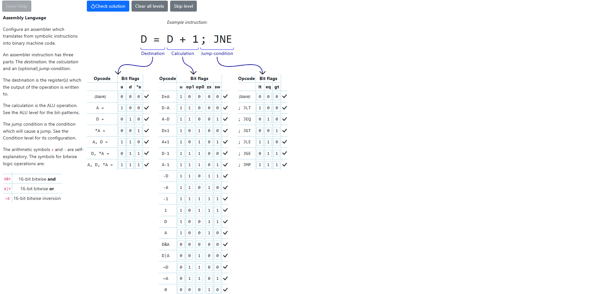

# Assembly Language
In this level we just implement the Assembly language by connecting 16-bit instructions to symbol instructions. We create syntax and assign meaning using instruction bit flags.

