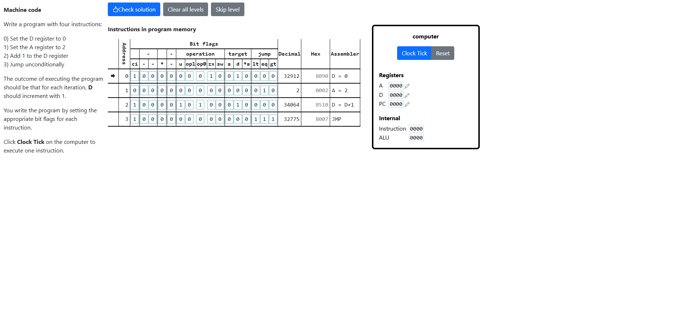

# Machine Code
In this level you learn about using machine code to execute instructions by setting bits. These bit flags are grouped for setting operations, targets and conditional jumps. The most significant bit, when 0, basically just sets the register A to whichever value the 16-bit instruction is, since its a Data Instruction. The bits 0-2 are for conditional jumps and the bits 3-5 are for setting register destinations. Bits 6-10 set the [operations](../Computer/Arithmetic-Logic-Unit/arithmetic_logic_unit.md#alu) programmed for execution. By default the operations are applied on D and A registers, otherwise when bit-13 is 1, they are applied on D and *A registers. When bit **u** is 0, the operations on Logic Unit are executed, otherwise, the operations on Arithmetic Unit are executed. Understanding how these bit flags work will lead you to solving this level.

