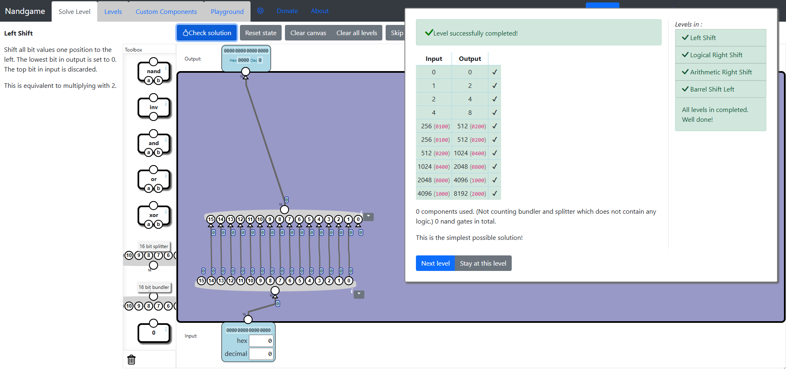
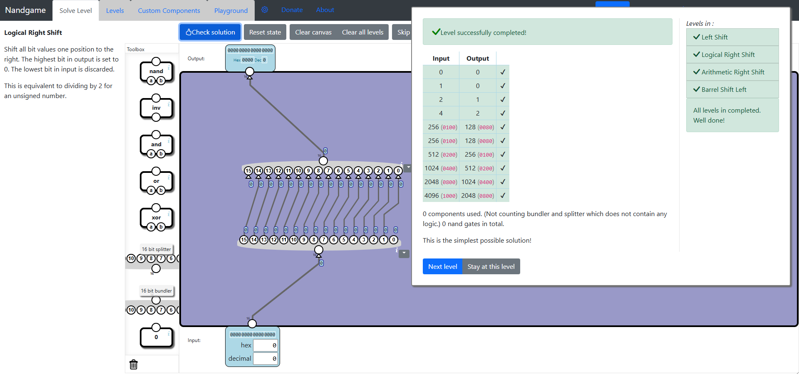
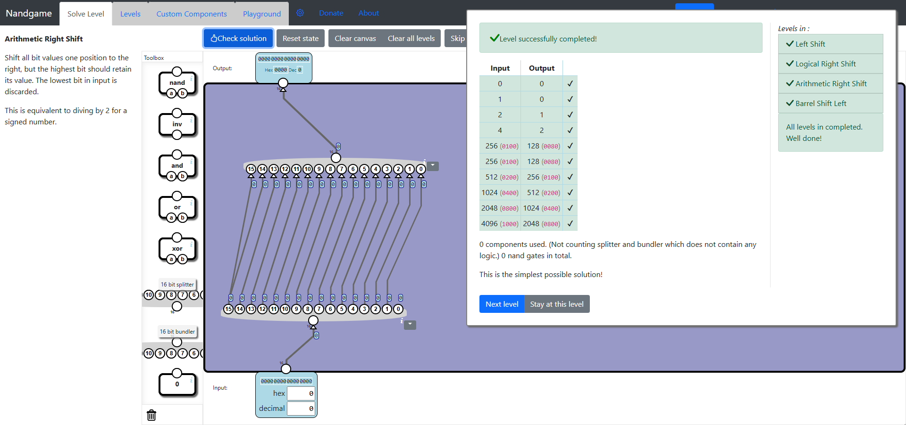
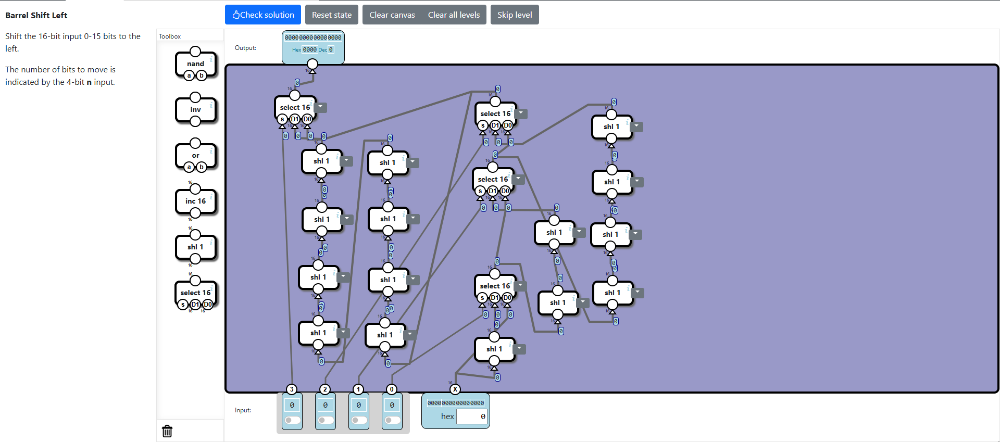

# Bit shifts levels
In this category we learn about methods of bit shifting.

## Solutions description
Most of the levels only require using **Splitters** and **Bundles**, which require no **Logical Gates**. 

## Left Shift
This level is very easy. Just move all the bits one position to the left using a Splitter and a Bundle.

## Logical Right Shift
This level follows the same idea, but towards the other direction.

## Arithmetic Left Shift
Here we use the same solution but we leave the bit-15 unchanged.

## Barrel Left Shift
In this level we get to implement multiple left shifting. The input is a 4-bit number (0-15) which determines the number of times the number will shift to the left. For each bit used for shifting multiple times we apply 2^i shifts depending on the bit position. In the en we end up with a working solution. 

