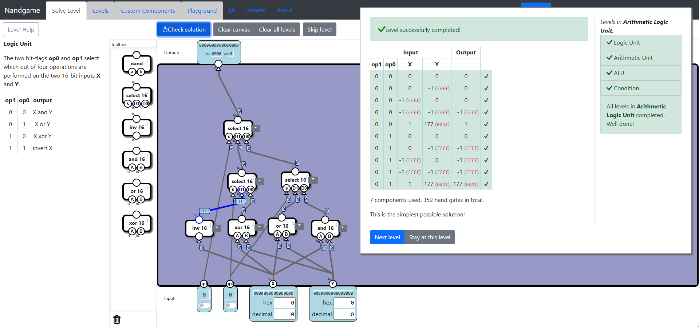
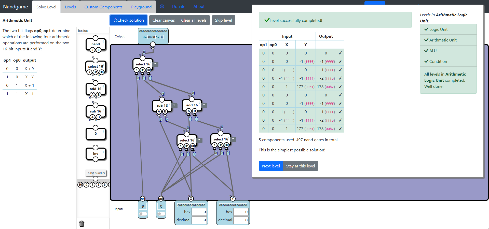
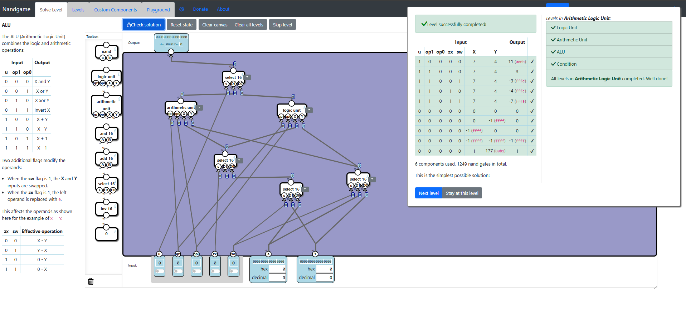
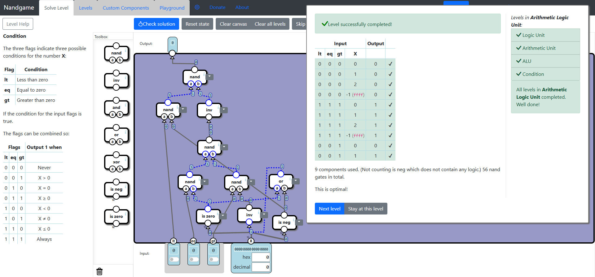

# Arithmetic Logic Unit
This subcategory is about building the ALU component, which is composed of an arithmetic unit and a logic unit. Both units are made out of arithmetic components and switches.

## Logic Unit
This is a super easy level, since we will have to use almost all the components from the Toolbox. We add the logic gates, bind them to the inputs, and then add three **Select** components to select between operations based on the **op1** and **op2** bits.

## Arithmetic Unit
Another easy level where we have to use almost all of the components from the Toolbox. The solution is similar to the previous level, but here we need to first select between inputs and then use the output of these selects for the arithmetic components.

## ALU
Again, this level is not that complicated, because the same idea is used. First, select the inputs, which are then used by the **Arithmetic Unit** and **Logic Unit**.

## Condition
This is not a very hard level, but it takes some time to optimize. First, we need to combine the condition bits with the inputs using logic gates and conditional gates. This requires basic logic knowledge, such as combining **Is Zero** and **Is Neg** to get a "less than or equal to zero" condition, and so on. After we've finished implementing all these conditions, we need to replace components by parts and remove redundant **Nand** gates.

