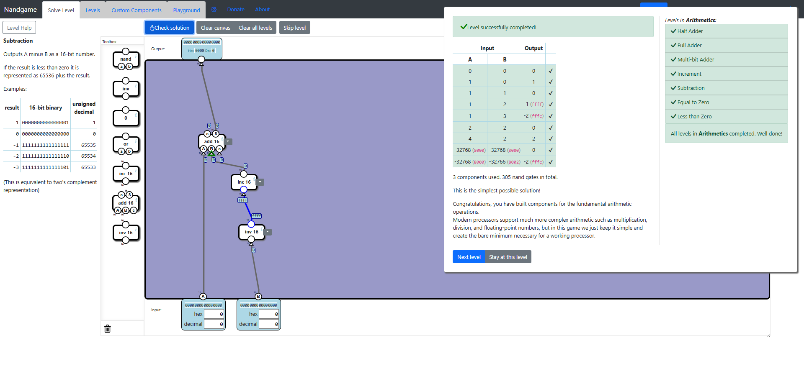

# Arithmetics
In this subcategory you have to implement addition, subtraction and comparison operations using logic gates. There will be levels with multiple outputs.

## Half Adder
This is not a very hard level to solve. Basically you have to implement the addition of two bits using logic gates. When both inputs are 0, both outputs are 0. When one of the inputs is 1, first output is 0 and second output is 1. When both inputs are 1, first output is 1 and second output is 0, which is the binary representation of number 2. The trick is to have the first output set to 1 and the second output set to 0 when both inputs are 1. For this we can use a gate for each output bit. So for the first output we would get 1 only when both inputs are 1. Clearly the **And** gate works here. Now for the second output, we want it set to 1 when one input is 1 and the other 0. The **Xor** gate works here. If we were to use the Or gate, the second output would be 1 when both inputs are 1 and that wouldn't work, because it has to be 0. So the first solution is to use **And** gate for the first output and **Xor** gate for the second output. Getting the optimal solution requires simplifying the circuits by reducing the number of **Nand** gates after replacing the components by parts using some intuition, eventually reaching a result similar to the [Xor optimal solution](../Logic-Gates/logic_gates.md#xor).


## Full Adder
In this level we encounter the challenge of adding 3 bits instead of 2. The maximum value we would get by adding all the input bits is 11 which is the binary representation of number 3. As a start I added together **b** and **c** inputs using an **Add** component. So far we have half of the solution done. Now we have to deal with input **a** in order to have a complete solution. I added another **Add** component to which I attached input **a** and output bit **l** from previous **Add** component. If we use the outputs from the second **Add** component as solutions, the level is still not fully solved, because we left out the output bit **h** from the first **Add** component and so, when we try to add three 1's or only inputs **b** and **c** set to 1, we don't get the desired result. We use another **Add** component, and we connect it to the **h** output bit of the first **Add** component, and the **h** output bit of the second **Add** component. The final output comes from the **l** bits of both second and third **Add** components. We managed to add all three bits and as a result we got a **Full Adder**.


For the optimal solution the same strategy as before is used, just replace by parts all the components, get rid of redundant connections and apply some intuition in order to get the same results with fewer **Nand** gates.


## Multi-bit Adder
This is a very easy level. We have to add 3 numbers, where two of these numbers are represented by 2-bit inputs and one number is represented by 1 bit. The least significant bit of the output has to be the sum of the least significant bits of the 2-bit inputs and the carry input. We can use the **Full Adder** component for that. Then the other two bits of the output are going to be calculated by using another **Full Adder** connected to the most significant bits of the 2-bit inputs and the most significant bit of the result from the first **Full Adder**. This way we solve the problem and we also have an optimal solution using just two **Full Adder** components.


## Increment
Another easy level. You have to increment the input by 1. You can use the **Add** component which takes two 16 bit inputs and a carry bit. Connect the **Add** component to the 16-bit input and the carry bit input to 1. How do we get 1 using logic gates? We use and **Invert** gate without attaching an input to it. This way it always outputs 1. As a result you add the 16 bit input and the result of the **Invert** gate, which is 1. Voila, you managed to increment a number by one.


## Subtraction
There is a trick to subtracting two numbers at hardware level. Calculating ```A - B``` is similar to calculating ```A + (-B)```. Subtracting two numbers is equivalent two adding the first number to the negative of the second number. This might seem obvious, but it will help us implement subtraction using the components from the tool box. The challenge is to implement negation of a number. Negation is not inversion. When we invert a number, we switch all its 1 bits to 0 and all its 0 bits to 1. But this is not how we negate a number, we only get the so called 1's complement of that number, which results into its inversion. The negation is called 2's complement of a number which has an extra step compared to inversion, and that is incrementing by 1. So negation is inverting a number and incrementing the result by 1. As a result the we add one number to the negation of the other number and we get subtraction. This only requires an **Add**, an **Inv** and an **Inc** component. This is also the optimal solution.



## Equal to Zero
Also an easy level. The output is 1 when all input bits are 0. So if any of the input bits is 1, the output is 0. Clearly we need a few **Or** gates and in the end we just invert the result since **Or** operation outputs 0 only when all inputs are 0. Using three **Or** gates and one **Inv** gate, we get the optimal solution for this level.


## Less than Zero
Very easy level, as long as we have a good understanding of how an integer number is represented in binary. Up until now we understood that positive natural numbers can be represented in binary form. The number of bits, for example 16, can represent positive natural numbers from 0 to 2^16 - 1 (65,535). When we talk about representing integers using 16 bits values, we have to take into account the sign, since integers include negative numbers. In binary the sign of a number is represented by the most significant bit(farthest left bit). For a 16 bit representation, we can handle values between -2^15 (-32,768) to 2^15 - 1 (32,767), since 1 bit is for the sign. In a 16 bit representation the bits are indexed from 15 to 0, from left to right. So the sign is represented by the 15th bit. So to solve this level we only use the 16-bit **Splitter** component, which splits the input into 16 bits. We connect the 15th bit to the output. If the bit is 1, the output will be negative. This is also the optimal solution and whats even more impressive, we used 0 gates, since the 16-bit Splitter is just a data bus.

