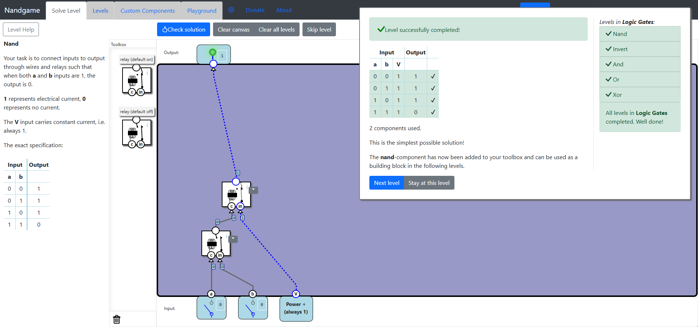
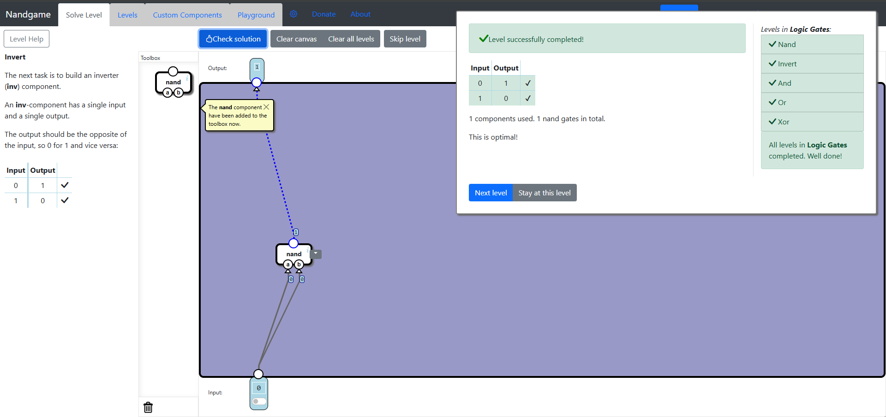
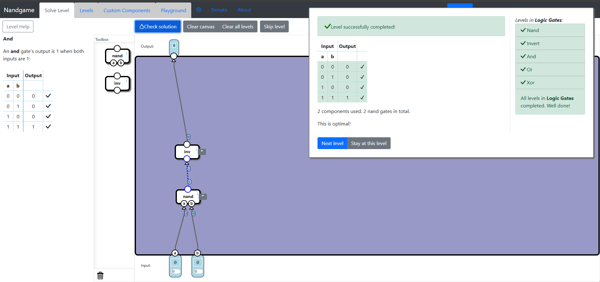
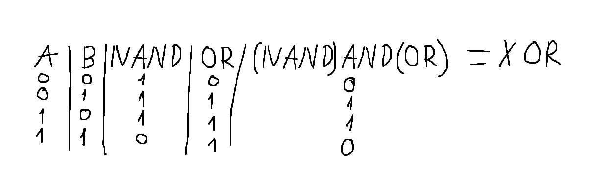
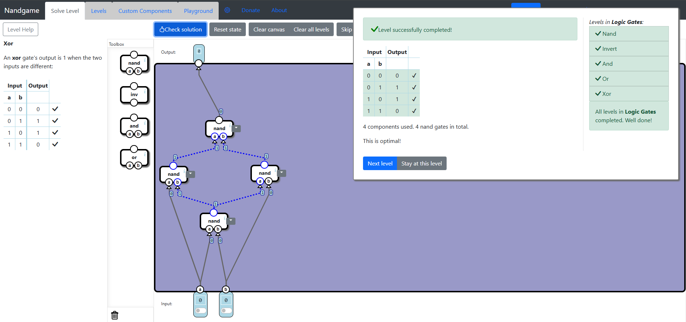

# Logic Gates
In this subcategory you have to implement the fundamental logic gates that will be used to build more complex components.

## Nand
To implement Nand Gate using relays you will have to add one default off relay connected to both input and one default on relay connected to the previous relay and the power on input. This way, the output will always be 1 except when both inputs are 1, since the current passes through a default on relay, and both inputs being 1 would switch the relay.

## Invert
This level is easier. You have to use Nand Gates to implement Invert Gate. It is pretty straight forward, you just connect both inputs of the Nand Gate to the same source, which then will output 1 when the input is 0, and 0 when input is 1. This one is hard to fail.

## And
We encounter another easy level. From here you begin to combine different components from the tool box and you start to find solutions using logic tables and combining logic operators. So what happens now? You combine Nand and Invert, Nand is Not And, so negating it will give you And. Two negatives is a positive. So use a Nand Gate and then pass the output to an Invert Gate. Voila, the And Gate!

## Or
This one is easy, but not Tutorial Mode easy. Some Logic Operator Theory doesn't hurt here. Digging a little into this field you will learn about De Morgan's Laws. The negation of A and B is same as negation of A or negation of B. Similarly, the negation of A or B is same as negation of A and negation of B. We can deduce from these laws that A or B comes from the negation of not A and not B. We have just the right tools to implement Or Gate. We just have to invert the inputs and pass them through the Nand Gate.
- not (A or B) = (not A) and (not B)
- not (A and B) = (not A) or (not B)
- not (not A and not B) = not (not A) or not (not B) = A or B

## Xor
This is an interesting Logic Gate, it outputs 1 only when both inputs are different, never when they have the same value. You would start to combine different logic gates by passing the Nand and Or results to an And Gate.

Getting an optimal solution requires replacing the components with parts and using some intuition. Fast forward, we get the solution.

