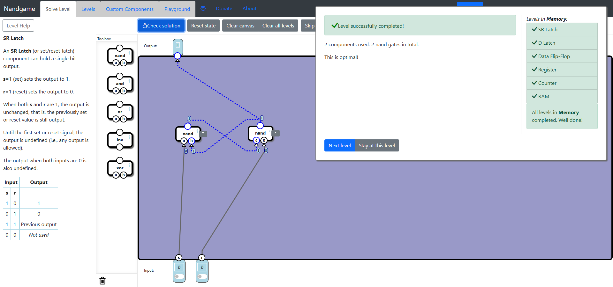
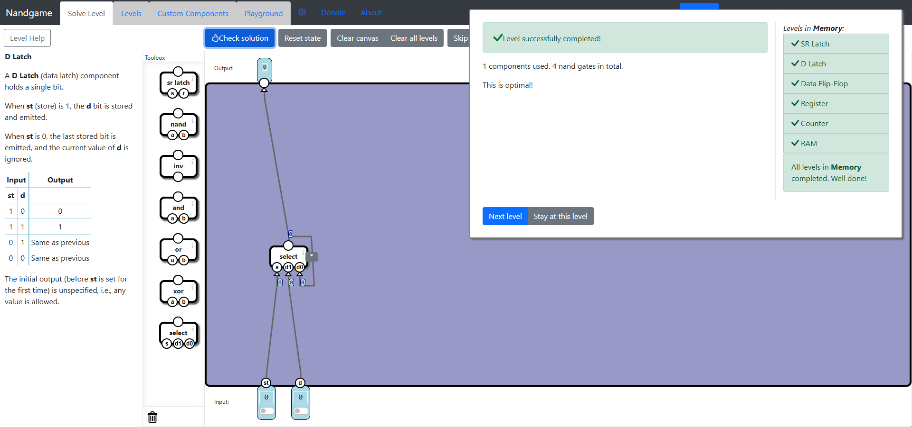
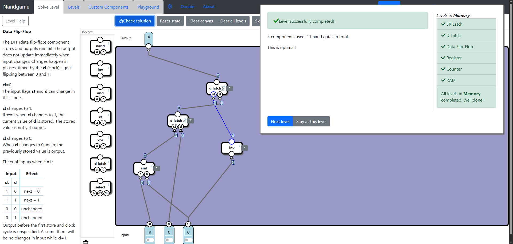
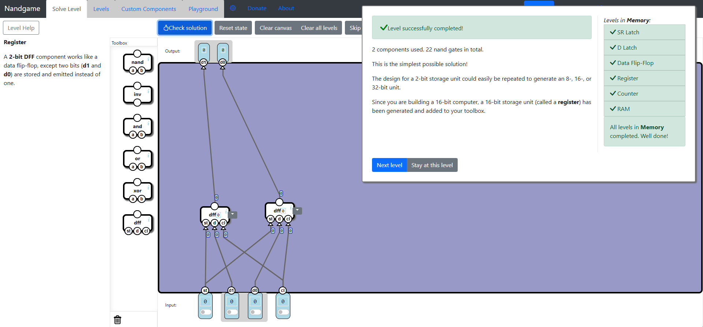
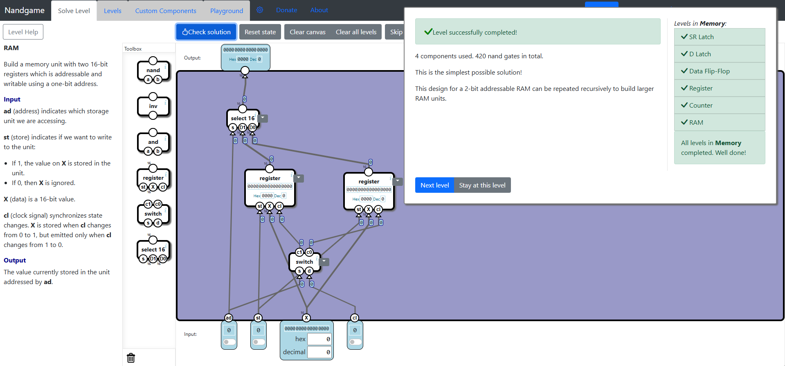

# Memory
In this subcategory we learn to implement basic memory components and registers eventually progressing towards implementing the RAM component. In order to implement these components we encounter a new strategy: circling around the data between components, by connecting the output of a component to the input of another component and the output of the latter component to the input of the former component. The solutions will not have a hierarchical structure anymore, but a circular one, or mixed, in order to keep the previous state of the output.

## SR Latch
In this level we learn about Set/Reset Latch, a basic memory component that can store 1 bit. The way it works is when the **set** bit is 1 and **reset** bit is 0, the output is 1. On the other hand when the **reset** bit is 1 and **set** bit is 0, the output is 0. Now an additional feature that this component has is that when both input bits are 1, the previous output remains the output. So we can store previous states, hence why this is a basic memory component. For the case when both bits are 0, the result is undefined, so not verified in this level.
 
The optimal solution is not straight forward but its simple. This can be implemented using only two Nand Gates. The **set** bit is connected to one Nand Gate and the **reset** bit to the other Nand Gate. The Nand Gate outputs 0 when both inputs are 1. So the other input needed for the Nand Gate connected to the **set** bit is the output of the Nand Gate connected to the **reset** bit. And the other input needed for the Nand Gate connected to the **reset** bit is the output of the Nand Gate connected to the **set** bit. Such a structure would always provide an input of value 1 to both Nand Gates when both **reset** and **set** bits are 0. When **set** bit is 1, the first Nand Gate outputs 0 and the second Nand Gate keeps its output to 1. If instead we would have **reset** bit to 1, the second Nand Gate would output 0 and the first Nand Gate would output 1. This way we give the correct answer using the output of the second Nand Gate when either input is 0 and the other is 1. 

What is left is giving the previous output when both input bits are 1. If we were to have the **set** bit on 1 first and then **reset** bit on 1 later, the output of the second Nand Gate would still be 1, because as it was explained, **set** bit on 1 keeps the first Nand Gate on 0 and second Nand Gate on 1. Now if we were to have the **reset** bit on 1 first and **set** bit on 1 later, the output of the second Nand Gate would still be 0, because as it was explained,  **reset** bit on 1 keeps the second Nand Gate on 0 and first Nand Gate on 1, and changing the **set** bit won't change the output because one input of the first Nand Gate will always be 0. This is how the optimal solution works.

## D Latch
We get to learn about an alternative to SR Latch, the Data Latch. You get two bits, the **set** bit and the **data** bit. With the **data** bit you change the value you want to store and with the **set** bit you store that value. Just using the Select component you get the optimal solution. The logic is that when **set** bit is 0, the output will always be the previous value. When the **set** bit is 1, the value will be the value of the **data** bit.

## Data Flip-Flop
Data Flip-Flop works the same way as D Latch, but there is an additional thing that is involved, the **clock** bit. Instead of the data being stored when the **set** bit is 1, it has to be timed with the **clock** bit being switched to 1. So this basic memory component works only when the **clock** bit switches from 0 to 1. Overall this is an easy level, since we get to use the D Latch component. We use two D Latch components, where the first one sets the data when the **set** bit and the **clock** bit are 1 and the second one sets the output to the output of the first D Latch when the **clock** bit is set to 0. We get the following optimal solution.

## Register
Not much to explain here at all. You manage to make a Register out of multiple DFF components.

## Counter
The Counter is very easy to implement, especially when we have the Register available in the Toolbox. The idea is to increment a number at each clock cycle. Using a Register we would just have to switch the input between the current value and its increment whenever the clock is switched to 1. When **set** bit is 1, the output is recovered to the original value. The optimal solution is straightforward.

## RAM
RAM is another easy level, since its all about adding up multiple registers together and switching between them based on an address. In this level, the address is 1 bit, and it is used to switch between the outputs of the registers and to enable and disable the clocking of the registers based on which register is addressed. Again, the optimal solution is not rocket science.

