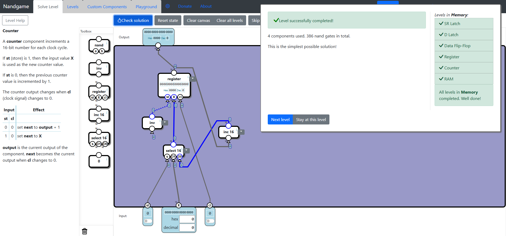

# Memory
In this subcategory, we learn to implement basic memory components and registers, eventually progressing towards implementing the RAM component. To implement these components, we encounter a new strategy: circulating data between components by connecting the output of one component to the input of another, and the output of the latter component to the input of the former. The solutions will no longer have a hierarchical structure, but a circular or mixed one, in order to preserve the previous state of the output.

## SR Latch
In this level, we learn about the **Set/Reset Latch**, a basic memory component that can store 1 bit. The way it works is: when the **set** bit is 1 and the **reset** bit is 0, the output is 1. On the other hand, when the **set** bit is 0 and the **reset** bit is 1, the output is 0. An additional feature of this component is that when both input bits are 1, the previous output remains the output. This way, we can store previous states, which is why this is a basic memory component. For the case when both bits are 0, the result is undefined, so it is not verified in this level.

The optimal solution is not straightforward, but it's simple. This can be implemented using only two **Nand** gates. The **set** bit is connected to one **Nand** gate and the **reset** bit to another **Nand** gate. The **Nand** gate outputs 0 when both inputs are 1. The other input needed for the **Nand** gate connected to the **set** bit is the output of the **Nand** gate connected to the **reset** bit. The other input needed for the **Nand** gate connected to the **reset** bit is the output of the other **Nand** gate connected to the **set** bit. Such a structure always provides an input of value 1 to both **Nand** gates when both **reset** and **set** bits are 0. When the **set** bit is 1, the first **Nand** gate outputs 0 and the second **Nand** gate keeps its output at 1. If instead we have the **reset** bit at 1, the second **Nand** gate outputs 0 and the first **Nand** gate outputs 1. This way, we give the correct answer using the output of the second **Nand** gate when one input is 0 and the other is 1.

What is left is giving the previous output when both input bits are 1. If we have the **set** bit at 1 first and then the **reset** bit at 1 later, the output of the second **Nand** gate will still be 1, because as explained, the **set** bit at 1 keeps the first **Nand** gate at 0 and the second **Nand** gate at 1. Now, if we have the **reset** bit at 1 first and the **set** bit at 1 later, the output of the second **Nand** gate will still be 0, because as explained, the **reset** bit at 1 keeps the second **Nand** gate at 0 and the first **Nand** gate at 1, and changing the **set** bit won't change the output because one input of the first **Nand** gate will always be 0. This is how the optimal solution works.

## D Latch
We get to learn about an alternative to the **SR Latch**: the **Data Latch**. We get two bits, the **set** bit and the **data** bit. With the **data** bit, we change the value we want to store, and with the **set** bit, we store that value. By just using the **Select** component, we get the optimal solution. The logic is that when the **set** bit is 0, the output will always be the previous value. When the **set** bit is 1, the value will be the value of the **data** bit.

## Data Flip-Flop
The **Data Flip-Flop** works the same way as the **D Latch**, but there is an additional element involved: the **clock** bit. Instead of the data being stored when the **set** bit is 1, it has to be timed with the **clock** bit being switched to 1. So this basic memory component works only when the **clock** bit switches from 0 to 1. Overall, this is an easy level, since we get to use the **D Latch** component. We use two **D Latch** components: the first one sets the data when the **set** bit and the **clock** bit are 1, and the second one sets the final output to the result of the first **D Latch** when the **clock** bit is set to 0. We get the following optimal solution.

## Register
Not much to explain here at all. We just make a **Register** out of multiple **DFF** components.

## Counter
The **Counter** is very easy to implement, especially when we have the **Register** available in the toolbox. The idea is to increment a number at each clock cycle. Using a **Register**, we just have to switch the input between the current value and its increment whenever the clock is switched to 1. When the **set** bit is 1, the output is restored to the original value. The optimal solution is straightforward.

## RAM
This is another easy level, since it's all about bundling multiple registers together and switching between them based on an address. In this level, the address is 1 bit, and it is used to switch between the outputs of the registers and to enable or disable the clocking of the registers based on which register is addressed. Again, the optimal solution is easy to implement.

