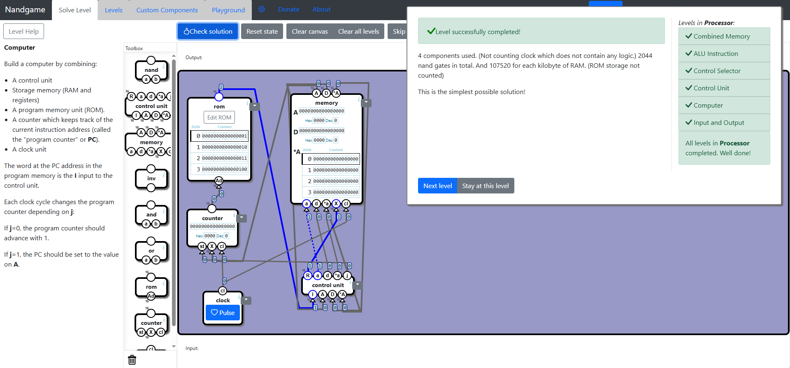

# Processor
In this subcategory we will use all the components we've made to create the Computer. The levels are about putting together these components and connecting the the inputs and outputs appropriately.

## Combined memory
Very easy level, you get the solution by following the instructions on the page, you just have to use two Registers and one RAM and connect the nodes as it is explained. One thing to note, the A register is the address of the value stored in *A register.Hard not to get it.

## ALU Instruction
This level is about splitting a 16-bit value, which represents an instruction, each bit specifying which operation should be done and where should the results be stored. Again, the solution is very straight forward.

## Control Selector
Here we just switch between the values of multiple Control Buses. A Control Bus carries commands from the CPU along with status messages from other components. The solution is obvious.

## Control Unit
This level provides an overview on how instructions are carried and written to the register. Based on the instruction 15-bit, either a Data instruction or an ALU instruction is executed. Can't brag much about the solution either.

## Computer
Finally we get to connect everything. We use a clock to trigger every cycle. We trigger the Counter to increment the value of the address selected in the ROM component. The value at address selected in the ROM is the instruction command we send to the Control Unit. The Control Unit has access the registers and RAM and the output is then sent to the memory. The memory provides an address to the counter which is then incremented, but he Counter will restore the initial address if the output of the ALU passes the conditions that were set in the instruction. We finally get a functioning basic Computer that has a CPU, Memory, and a Control Bus.

## Input and Output
This additional level is about understanding how input and output signals work. This is an easy level to follow. 

