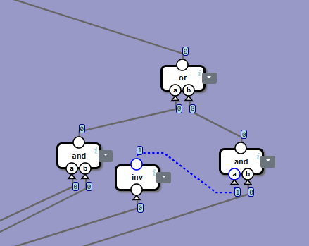
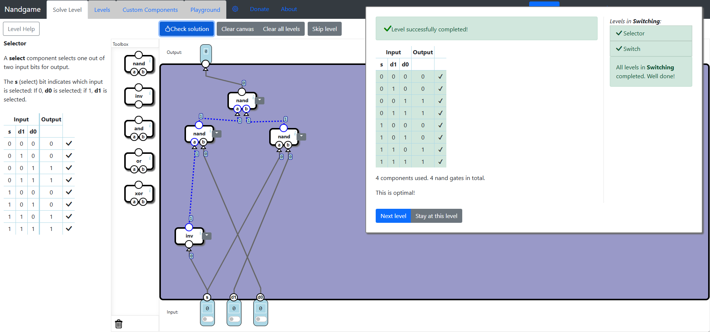
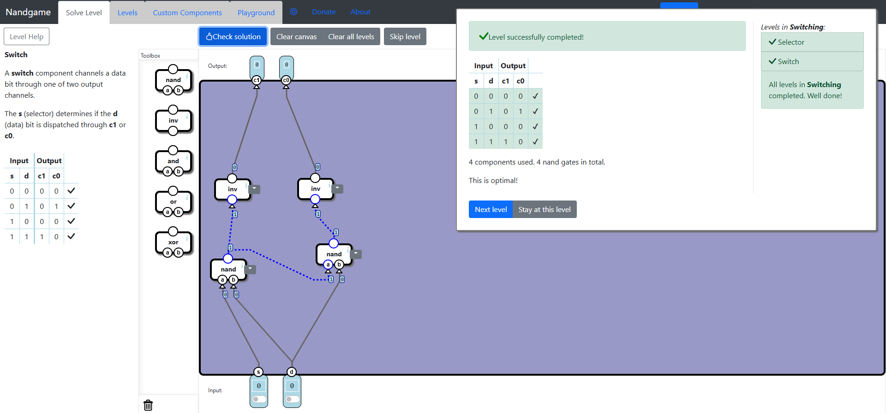

# Switching
In this subcategory, we implement bit selection and bit switching, the next leap from logic gates and arithmetic operations.

## Selector
We select the output based on a single bit. When bit **s** is 0, the **d0** input will be the output; otherwise, the **d1** input will be the output. The logic is to allow **d1** to be the output when **s** is 1 using an **And** gate. This way, the output will change only when **d1** changes. For **d0**, we do the opposite: we select it to be the output when **s** is 0 using an **And** gate, but also an **Inv** gate for **s**, so that when it's 0, the **Inv** result will be 1. Finally, we use an **Or** gate to combine both results.

To get the optimal solution, replace all the components by parts and remove redundant **Nand** gates. We will get the following solution.

## Switch
This is a very easy level, because the solution is the same as [Selector](switching.md#selector), but without the **Or** gate, since we don't need to combine the results of the **And** gates. After replacing all the components by parts and removing redundant **Nand** gates, we get the optimal solution.

