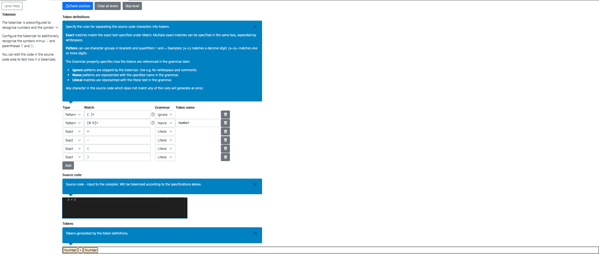
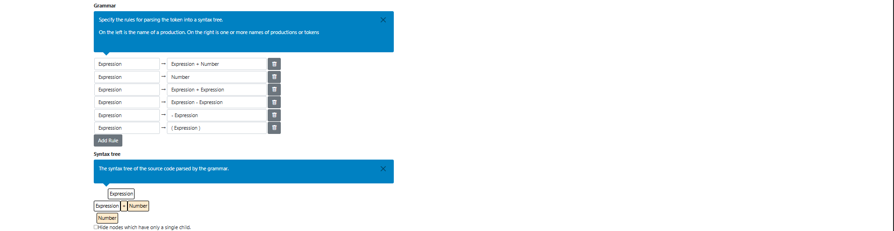
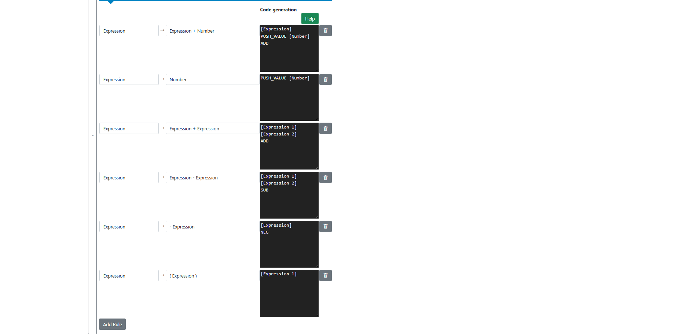
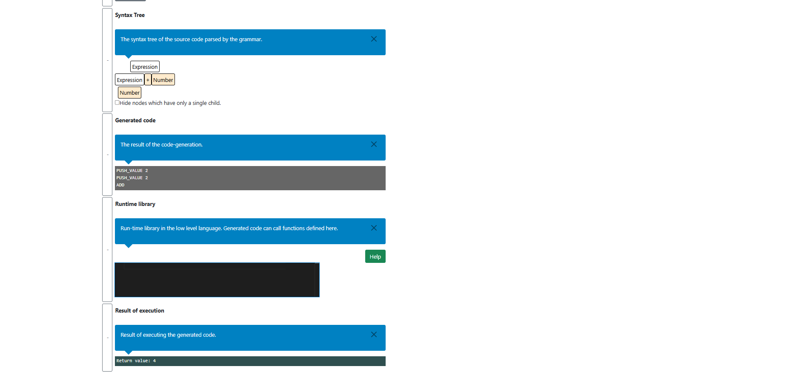

# Compiler levels
In this subcategory, we learn about tokenizer, code language grammar and code generation.

## Tokenize
In this level we have to add new items to the tokenizer in order to recognize new symbols. Just add the required symbols that the level description mentions.

## Grammar
In this level we need to add grammar rules for parsing the token into a syntax tree.

## Code Generation
After the grammar phase we need to assign each grammar rule a code template from which low level code is generated.

## Final result
In the end, we managed to generate low level code from high level languages by defining tokens, grammar rules and grammar templates.

