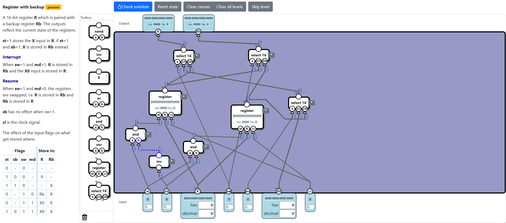

# Multitasking CPU Levels
In this category, we learn about multitasking at the hardware level.

## Solutions Description
Most levels are similar to the [Processor](../Computer/Processor/processor.md) subcategory from Computer, and in the end, we will create a CPU that has multitasking features. The solutions are not optimal since they are only verified for their output.

## Timer Trigger
In this level, we have to output 1 every 256 clock cycles. We do that by using a **Counter** which increments a value, and when that value reaches 256 (when bit 8 is 1), we reset the value back to 0. The output is bit 8. When we reset, we set the **Counter** back to 1. In the end, we get the solution.

## Mode Controller
In this level, we have to implement a mode controller that outputs the operating mode (0 = kernel mode, 1 = user mode), a flag for mode change, and a code for the cause of the interrupt when changing from user mode to kernel mode (01 = timer trigger, 10 = swap). We have 3 inputs: a flag for changing the current mode, another flag for changing the mode that only works when in user mode, and a clock. Each clock cycle, the mode can be changed. The solution is divided into two parts: one that deals with the current mode and mode-change status, and another that deals with the cause of the mode change.

The **md** output must change when the **sw** input is 1 during a clock cycle. When the **tt** input is 1, **md** will only change in user mode. **sw** output is 1 when **sw** input is 1 during a clock cycle, and when **tt** input is 1, **sw** output will be 1 only if the current mode is user. So, obviously, we need to store the current mode in a **DFF** component. We connect the clock to the **DFF** component. The data input of the **DFF** component will be the result from an **Xor** component between the **DFF** stored value and the clock, to switch between 0 and 1 at each clock when **sw** input is 1. The set input of the **DFF** component is the output of an **And** component that takes the clock as an input and the result of a **Select** component that selects between **sw** and **tt** inputs based on the situation when the current mode is user and **tt** input is 1. When this happens, **tt** input will set the current mode in **DFF**; otherwise, the select will choose the **sw** input to set the current mode in **DFF**. The changed flag will be 1 when either **sw** input is 1 or when **tt** input is 1 during user mode. That means it will be the result of an **Or** component between the **sw** input and the **And** component result which signals when **tt** is 1 and the current mode stored in **DFF** is user.

The second part of the solution selects between 10 and 01 based on the **sw** input and then selects the result only when **sw** output is 1; otherwise, the **IR** output is going to be 0. We get the following solution.

## Register with Backup
In this level, we have to implement the register backup when an interrupt happens (switch from user mode to kernel mode). For this, we require two registers. The first one stores **X** by default, when the **st** input is 1 and **sb** is 0. The second one stores **X** when both **st** and **sb** inputs are 1. When no mode switch occurs, the main register output will get data from the first register and the backup register will get data from the second register. When a mode switch occurs, the main register will get data from the second register during resume, or **X0** input during interrupt. The backup register will get data from the second register during resume and the first register during interrupt. In the end, the solution is simple.

## Program Counter
This level is fairly easy, because we have the main part available in the toolbox. We implement a program counter that works with a register component that has backup. This way, we will have a **Program Counter** with a **Program Counter Backup**. We increment the counter based on the **j** input. When the mode is switched to kernel (interrupt), the program counter will take the value of **X0**, which is 0. The **st** input of the register component is always 1. Finally, we get the solution.

## Register Bank
In this level, we bundle together 4 registers, each having a backup. One is a program counter, one during interrupt will store the backup on the main register, one will store the mode change cause in the main register, and the last one will set the main register to 0. The solution is easy to implement.

## General-Purpose Memory
Another simple level where we bundle a bunch of registers together in order to output the values stored at two addresses, **a** and **pc**. The solution is easy to follow.

## Virtual Memory
In this level, we extend 16-bit values to 18-bit values (2 more bits), by extracting the extra digits from the **M** input based on the most significant bit of the other inputs as specified in the level. This is also an easy solution to find.

## Control Unit
This is a similar level to previous ones, where the outputs depend on a bunch of bit flags and selects. This is another straightforward, easy solution.

## Processor
In this level, we finally get to connect all the components we've made and form a CPU that allows operation interrupts and resumes. We connect the memory to the control unit and the control unit to the registers and the mode handler. We connect the registers to the control unit. The mode handler is connected to the registers and the timer trigger to the mode handler. Finally, we connect the clock to everything. In the end, we get a working CPU.

