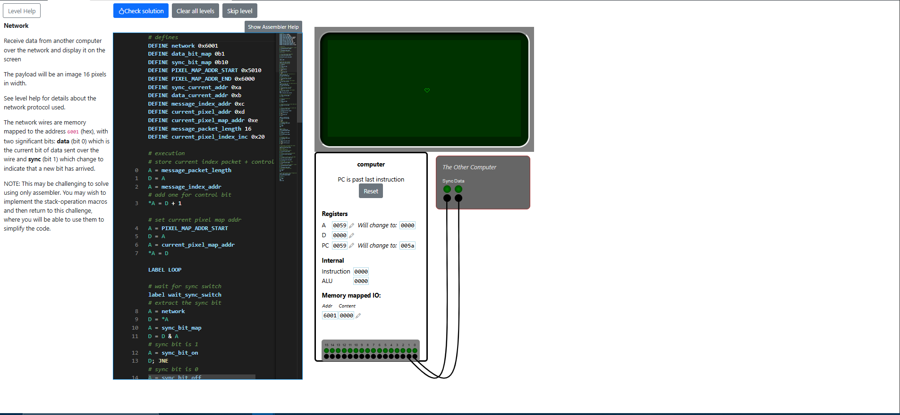

# Network Level
In this level, we get to do a project using Assembly code. The problem requires us to print an image on a display using pixels transferred from another computer device.


## Problem Explanation
We have to print an image using data transferred from another computer device. Our computer receives data using 2 bits: the **sync** bit and the **data** bit. Over time, these bits change, and we have to process them to get the final result. We process the data by evaluating the **sync** bit whenever it changes, from 0 to 1 or from 1 to 0. When we detect a switch on the **sync** bit, we can then process the **data** bit. For example, if the **sync** bit is 0 and the **data** bit is 1, and later the **sync** bit switches to 1, we read the **data** bit and process it.

The question is: how do we get from reading some random bits to displaying an image? The answer is that there is a network protocol we must follow to handle these messages. Basically, the protocol specifies that we have to read the **data** bit when the **sync** bit switches. Additionally, we have to understand the message format. The data bits are grouped into a message of 17 bits, where the first bit is the control bit and the remaining 16 bits are the actual data—the payload, or pixel data. The control bit, when set to 1, specifies that the transmission of data continues; otherwise, the transmission is over. So we receive 17-bit packets until the control bit (the first bit in the packet) is 0. After the transmission is over, we will have the image printed on the display.


## Solution Explanation
I didn't follow the NOTE and managed to implement the solution without using any stack-operation macros. I also defined all the needed macros at the beginning of the program. I will explain their purpose when I discuss the code that uses them. I tried to choose suggestive names.
```
DEFINE network 0x6001
DEFINE data_bit_map 0b1
DEFINE sync_bit_map 0b10
DEFINE PIXEL_MAP_ADDR_START 0x5010
DEFINE PIXEL_MAP_ADDR_END 0x6000
DEFINE sync_current_addr 0xa
DEFINE data_current_addr 0xb
DEFINE message_index_addr 0xc
DEFINE current_pixel_addr 0xd
DEFINE current_pixel_map_addr 0xe
DEFINE message_payload_length 16
DEFINE current_pixel_index_inc 0x20
``` 

First, we store some values that we will need later: the message length and the address where we want to start drawing the image (must be between 0x4000 and 0x6000). First, we access the address that we want to use for storing the bit length of the message, which is 16 + 1 bits.
```
# store current index packet + control
A = message_payload_length
D = A
A = message_index_addr
# add one for control bit
*A = D + 1
```

Then, we access the address that we want to use for storing the display pixel address on which we will start setting pixels from the transmitted data. This address will store the current pixel we will draw and will be incremented for every received message.
```
# set current pixel map addr
A = PIXEL_MAP_ADDR_START
D = A
A = current_pixel_map_addr
*A = D
```

Now the main loop will start, where the receiving and drawing events are handled, and which will run until the control bit from the message received is 0.
```
LABEL LOOP
```

As the network protocol specifies, we need to wait for a switch on the **sync** bit. Until then, we cannot proceed with processing the **data** bit. We first access the network bits, then apply a bit mask to extract the **sync** bit value and jump to an address depending on the value.
```
# wait for sync switch
label wait_sync_switch
# extract the sync bit
A = network
D = *A
A = sync_bit_map
D = D & A
# sync bit is 1
A = sync_bit_on
D; JNE
# sync bit is 0
A = sync_bit_off
D; JEQ
```

If the **sync** bit is 1, we check the previous **sync** bit we stored. If it's equal to 0, we exit the waiting loop for the **sync** switch.
```
# check switch when sync bit is 1
label sync_bit_on
A = sync_current_addr
D = *A
# sync switched, exit wait
A = end_wait_sync_switch
D; JEQ
```

If the **sync** bit is 0, we do the same, but we exit the waiting loop if the stored **sync** bit is 1.
```
# check stored sync bit when sync bit is 0
label sync_bit_off
A = sync_current_addr
D = *A
# sync switched, exit wait
A = end_wait_sync_switch
D; JNE
```

If no switch happened, we continue the loop by jumping to the address at the start of the loop in both cases.
```
# sync didn't switch, wait again
A = wait_sync_switch
JMP
```

Once the switch happens and we exit the wait loop, we store the current **sync** bit for future data readings.
```
# update stored sync bit
A = sync_current_addr
*A = ~*A
```

Now we read the **data** bit using the same method as for reading the **sync** bit, by applying a mask.
```
# extract the data bit
A = network
D = *A
A = data_bit_map
D = D & A
```

We store the **data** bit for processing after checking what type of **data** bit it is: control bit or part of the payload.
```
# temporarily store current data bit
A = data_current_addr
*A = D
```

When we evaluate each payload, we use iteration to know which part of the message the **data** bit represents according to the protocol message format. Each message is of length 17: 1 bit for the control bit and 16 bits for the payload. Based on an index that we store, we check to see in which part the **data** bit belongs—control bit or payload—and then process it accordingly. We subtract the payload length from the current message index, and if we get a result greater than 0, it means that the index points to a control bit; otherwise, while the result is negative, it will point to a pixel bit, which is part of the payload. This index will be decremented later. Each cycle, it starts at 17 and decreases to 0, which marks a new message reading in the next cycle.
```
# check if control bit or pixel bit
A = message_index_addr
D = *A
A = message_payload_length
D = D - A
A = is_control_bit
D; JGT
A = is_pixel_bit
D; JLE
```

If the **data** bit is a control bit, we check the **data** bit that we stored to be 0 in order to end the program loop; otherwise, we begin processing a new message by jumping to the start of the main loop.
```
label is_control_bit
A = data_current_addr
D = *A
A = end
D; JEQ
# decrement index
A = message_index_addr
*A = *A - 1
D = *A
A = LOOP
JMP
```

If the **data** bit is a pixel bit, we first add it to the currently stored pixel data, and store it again.
```
#build pixel
label is_pixel_bit
A = current_pixel_addr
D = *A
A = data_current_addr
D = D + *A
A = current_pixel_addr
*A = D
```

After that, we check the message index after decrementing to see if we are at the end of the payload or not.
```
# decrement index
A = message_index_addr
*A = *A - 1
D = *A
A = do_write_and_reset
D; JEQ
A = left_shift_by_sum
D; JNE
```

If we are at the end of the payload, we get the final pixel value and write it to the current display pixel address.
```
# write data to display and reset
# index and pixel value
label do_write_and_reset
# get current pixel value
A = current_pixel_addr
D = *A
# write to current pixel map addr
A = current_pixel_map_addr
A = *A
*A = D
```

Then we proceed with incrementing the current display pixel address and store it for future writing. It is incremented by 32 (0x20) to write the pixel on the next line at the same position.
```
# increment current pixel map addr
A = current_pixel_index_inc
D = A
A = current_pixel_map_addr
*A = D + *A 
```

After incrementing the display pixel address, we reset the pixel value and the message index and go back to the beginning of the main loop.
```
# reset index and pixel data
A = current_pixel_addr
*A = 0
# store current index packet + control
A = message_payload_length
D = A
A = message_index_addr
# add one for control bit
*A = D + 1
A = LOOP
JMP
```

If the current message index is not at the end of the payload, we left shift the current pixel value by multiplying it by 2 (or adding it to itself). This is how we form a 16-bit value from the **data** bits received in the same order: by shifting the value and adding the **data** bit. After we are done, we go back to the beginning of the main loop.
```
# left shift pixel value through sum
label left_shift_by_sum
A = current_pixel_addr
D = *A
D = D + *A
*A = D
A = LOOP
JMP
label end
```


The final code can be found here: [Network solution](./Network.txt)


## Level Result
The image result is:


