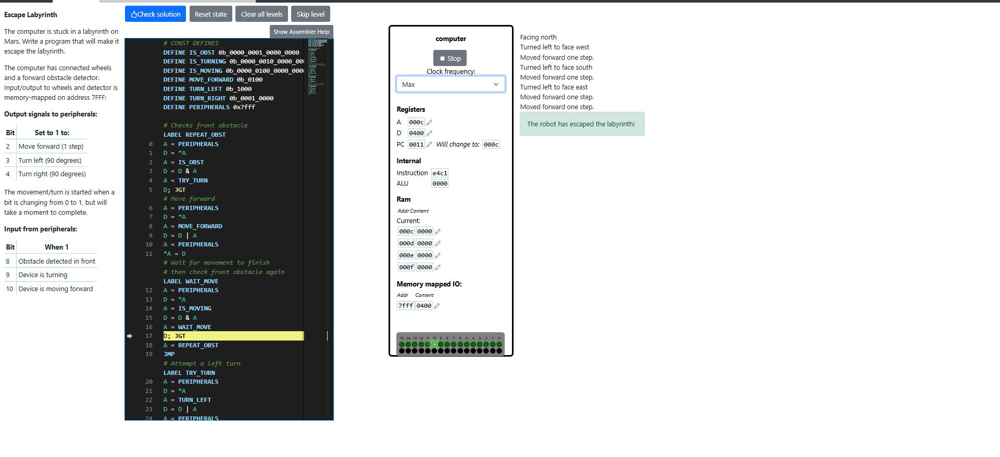

# Escape Labyrinth
In this level we use Assembly code to program a robot exit a labyrinth using controls and sensors. 

## Problem explanation
The idea is to explore a labyrinth using a robot until we find the exit. We get access to input and output peripherals of the robot in order to control its direction and detect the obstacles in front of it. If there is no obstacle, we can move forward. The access to controls and sensors is made through processing bits on an the robot memory address. 

The output signals are set on bits 2, 3 and 4, and the input signals are set on the bits 8, 9 and 10. We have to switch the input signal bits and read the output bits in order to reach to goal of this task. Each robot action such as turning or moving will take a while and when they are finished we can continue processing the data and controlling the robot.

## Solution explanation
We first set the macros we need through the program. These are meant to be the masks we use for extracting the needed bits from the robot data address for evaluating obstacles, checking current robot actions and setting robot actions.
```
# CONST DEFINES
DEFINE IS_OBST 0b_0000_0001_0000_0000
DEFINE IS_TURNING 0b_0000_0010_0000_0000
DEFINE IS_MOVING 0b_0000_0100_0000_0000
DEFINE MOVE_FORWARD 0b_0100
DEFINE TURN_LEFT 0b_1000
DEFINE TURN_RIGHT 0b_0001_0000
DEFINE PERIPHERALS 0x7fff
```

We create an infinite loop that always checks for obstacles. We first access the robot peripherals address and apply the obstacle mask and we check the value. If the obstacle bit is 1, we need to do a turn.
```
# Checks front obstacle
LABEL REPEAT_OBST
A = PERIPHERALS
D = *A
A = IS_OBST
D = D & A
A = TRY_TURN
D; JGT
```

If the obstacle bit is 0 we continue to the next instruction, which is moving the robot forward, since there is no obstacle. We move the robot forward by adding 1 to the bit-2 of the peripheral data using the Or operations.
```
# Move forward
A = PERIPHERALS
D = *A
A = MOVE_FORWARD
D = D | A
A = PERIPHERALS
*A = D
```

We then have to wait for the action to complete by entering a new loop which ends when the bit-10 of the peripheral data is 0 again. We use a bit mask to extract the value of the IS_MOVING bit. Once the loop is finished, we go back to the beginning of the main loop to check again or obstacles.
```
LABEL WAIT_MOVE
A = PERIPHERALS
D = *A
A = IS_MOVING
D = D & A
A = WAIT_MOVE
D; JGT
A = REPEAT_OBST
JMP
```

If after checking an obstacle we get a 1 from reading the IS_OBST bit, we try turning a robot to another direction. We attempt a turn by changing the bit-3 of the data peripherals using bit mask again. We add 1 to bit-3 and this will also set the robot turning status to 1.
```
# Attempt a left turn
LABEL TRY_TURN
A = PERIPHERALS
D = *A
A = TURN_LEFT
D = D | A
A = PERIPHERALS
*A = D
```

We wait again for the action to finish, by checking the IS_TURNING bit in a loop until it is 0. And then we jump to the beginning of the main loop to check for new obstacles.
```
# Wait for turn to finish then
# check front obstacle again
LABEL WAIT_TURN
A = PERIPHERALS
D = *A
A = IS_TURNING
D = D & A
A = WAIT_TURN
D; JGT
A = REPEAT_OBST
JMP
```

We keep turning the robot until the obstacle status is 0, and then we move forward. Doing all of this repetitively we manage to help the robot escape the labyrinth.

The final code can be found here: [Labyrinth escape solution](./Escape-Labyrinth.txt) 

## Level result
Labyrinth escape tracking result is:


