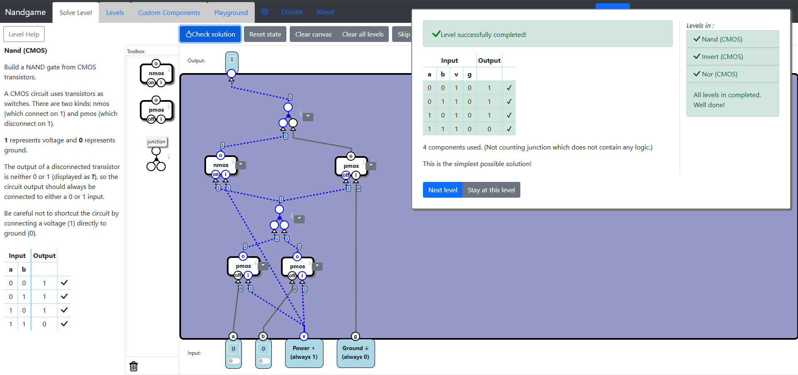
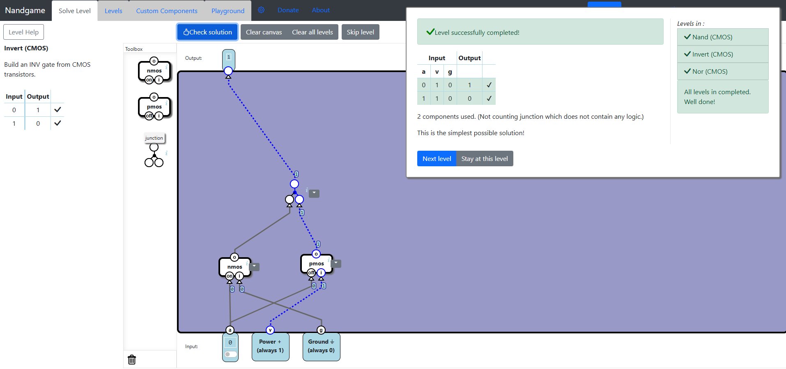

# Transistor Level
In this category you learn about logic gates at the transistor level.

## Solutions description
Using components from the Toolbox, we will need to implement Logic Gates, but instead of analog gates, we use transistors as switches. We will use the **PMOS** and **NMOS** transistors. **PMOS** transistor connects the input to the output when **off** input is 0 and disconnects when 1. **NMOS** transistor connects the input to the output when **on** input is 1 and disconnects when 0. We also use wire junctions to combine multiple outputs. This junction will cause a short circuit when one input is 1 and the other 0.

## Nand (CMOS)
In this level we will have to connect 4 outputs, two being the input switches and the other two being the Power (always 1) and the Ground (always 0). We will first connect two **PMOS**  transistors to the input switches and to the Power input. We then apply a junction on these two transistors. We can see that we managed to solve 3 out of 4 cases. The case that is left is when both switch inputs are 1. For this we need two more transistors, a **NMOS** and a **PMOS**, which are connected to the junction. Then we connect the Power to **NMOS** and the Ground to **PMOS**. We use another junction on these two transistors.  and we get the final result. This way, when both input switches are 1, the first junction is disconnected, and the **NMOS** transistor will also be disconnected. Only **PMOS** will be connected and will output 0 from the Ground input. 

We get the final result:

## Invert (CMOS)
This level is easier. We connect Power to a **PMOS** and Ground to a **NMOS** and we use the same input switch for both. We then use a junction and we get the solution. The idea is to disconnect one transistor and connect the other while using Power as input for **PMOS** and Ground as input for **NMOS** which will reverse the value of the input switch. We get the optimal solution.

## Nor (CMOS)
This level is similar to Nand (CMOS) level, but we need to add some small changes. We first use two **NMOS** transistors instead of **PMOS**, which are connected to the switch inputs and to the Power. We then use a junction which we connect to two more transistors, a **NMOS** and a **PMOS**. The **NMOS** is connected to Ground and **PMOS** to Power. We use a junction on these two and get the final solution. The idea is that using **NMOS** transistors, the first junction will output nothing when both switch inputs are 0. If we connect this junction to a **PMOS** that is also connected to Power, the output will always be 1 since the other **NMOS** transistor is disconnected. If one of the input switches is 1, the first junction will be 1, meaning that the top **NMOS** transistor is connected and the **PMOS** is disconnected. But the **NMOS** is connected to ground, so the final output will be 0.

